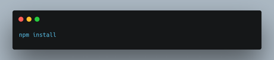
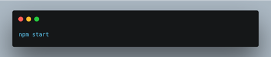
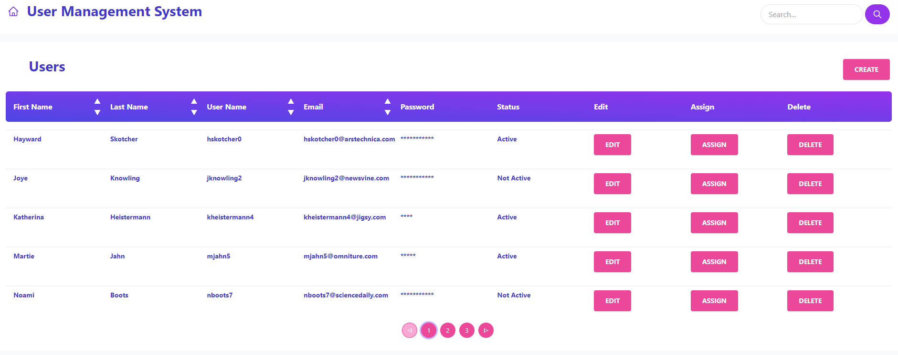
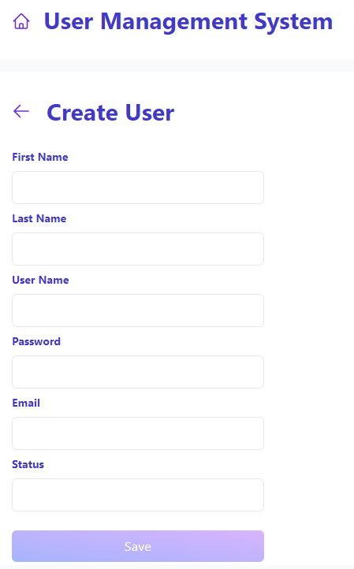
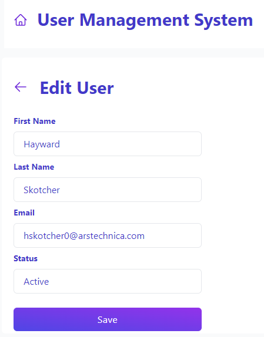
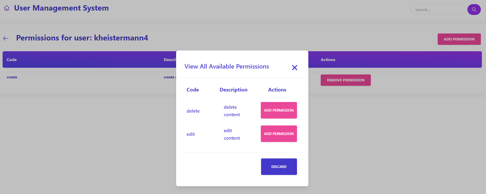

**User Management System**

This application is a user management system built with Create React App and styled with Tailwind CSS.\
It allows for the viewing, adding, editing, and deleting of users, as well as adding and removing permissions for individual users.  
Users can be ordered by first name, last name, username, and email, and pagination is also implemented.

This application makes use of the Redux library for state management and React Router for client-side routing.  
Data is consumed from a minimal API built in Visual Studio using C# and an SQL database.

**Features:**

- View user data
- Add new user
- Edit existing user
- Delete user
- Add or remove permissions for individual users
- Sort users by first name, last name, username, and email
- Pagination

**Technologies used:**

- Create React App
- Tailwind CSS
- Redux
- React Router
- Minimal API with Visual Studio (C#)
- SQL

**Getting started**

To run this application locally, you will need to have Node.js and npm installed.  
Once you have those set up, clone this repository and navigate to the project's directory in your terminal. Then, run the following commands:

This command will install all the necessary external libraries that the application depends on, including Redux, React Router and other dependencies listed in the package.json file.

This command will start the development server.  
The application will be available at http://localhost:3000.

Please note that this application expects to consume data from a separate API, so you will need to configure local API endpoint in the separate env file.

That's it! You're now ready to start managing users with this application.
   
 

**Application preview**

Main View

Create User VIew

Edit User VIew

Add Permission VIew

